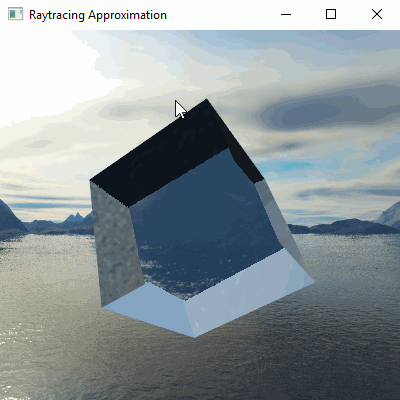
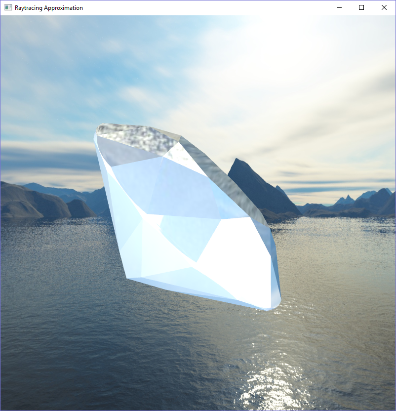
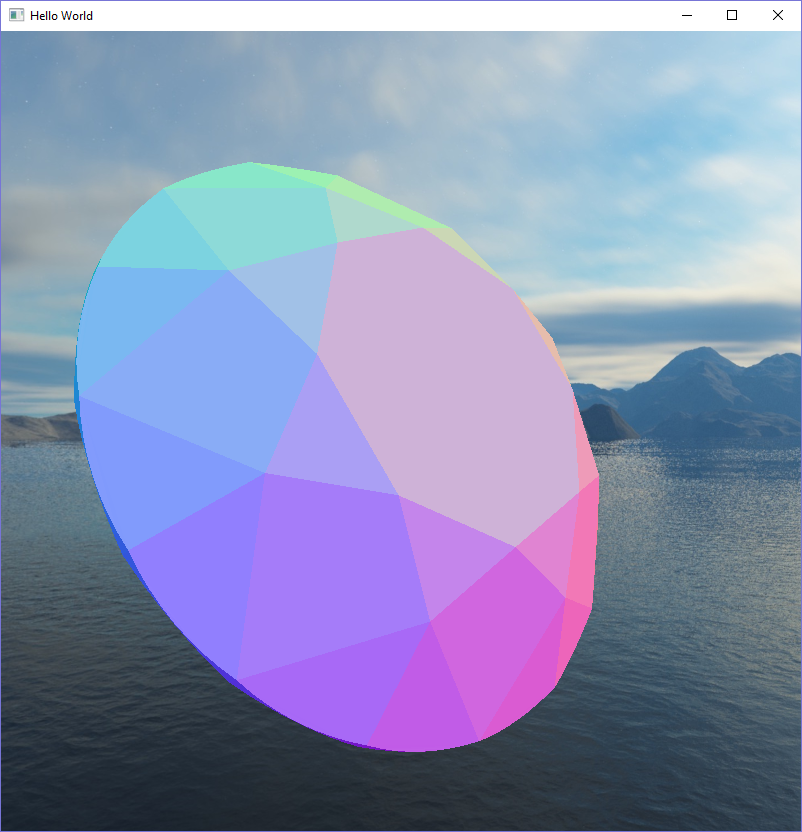
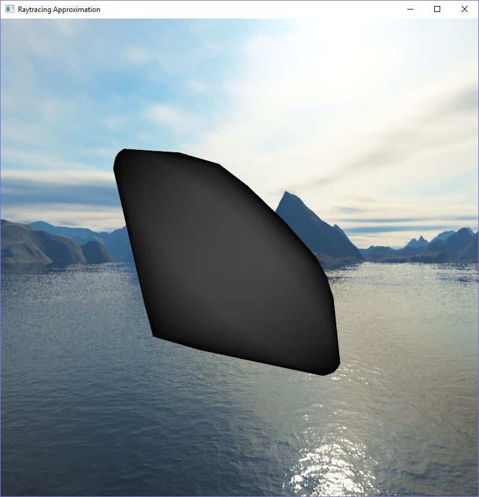

# raytracing-realtime-approximation
Realtime raytracing approximation using a double-pass technique.

This is an implementation of Wyman's 2005 double-pass raytracing approximation algorithm. For more information, please see the accompanying report.

# Controls

- C load cube model
- D load diamond model

- Space toggle lighting
- 1 two-pass approximation
- 2 surface apporixmation
- 3 front normals
- 4 back normals
- 5 front depth
- 6 back depth
- 7 total depth

# Screenshots

# Bugs

+ Minimizing and maximizing sporadically crashes the program (under investigation)
