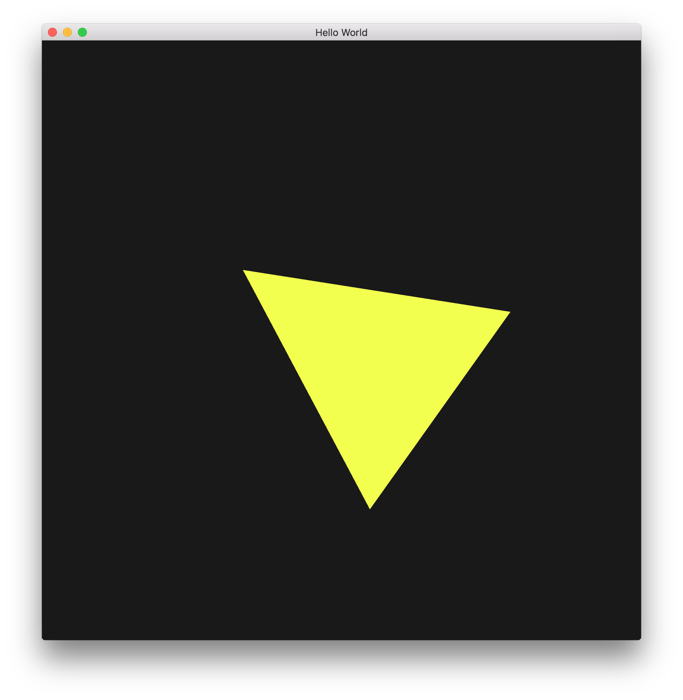
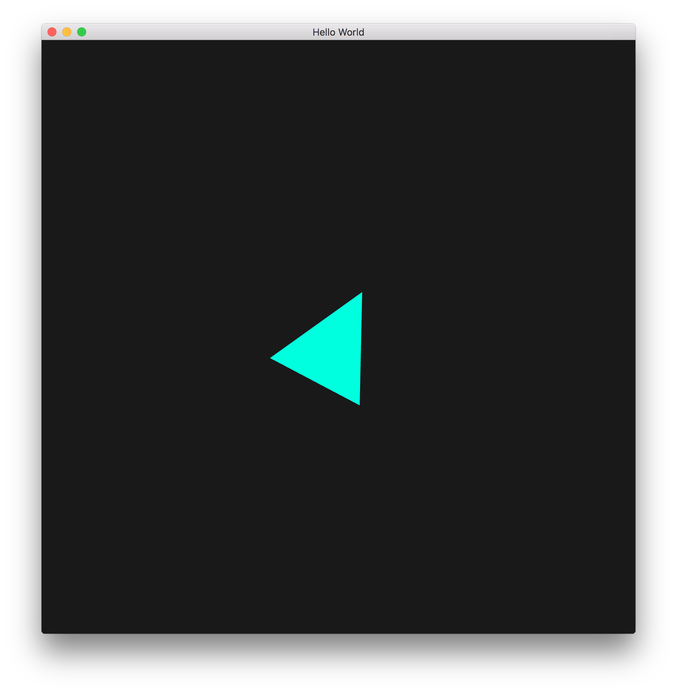

# raytracing-realtime-approximation
Implementation of Wyman's realtime raytracing approximation from 2005.

## Screenshots




## Instructions

Clion uses CMake which should simplify using GLFW3, GLEW, and GLM.

### MacOS

Brew has up-to-date versions of all three dependencies.

```
brew update
brew install glfw glew glm cimg
```

cimg requires XQuartz be installed.
