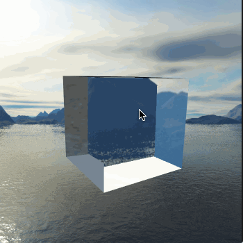

# raytracing-realtime-approximation
Implementation of Wyman's realtime raytracing approximation from 2005.

## Screenshots



## Instructions

Designed to be edited and run with Visual Studio Code.

### MacOS

Brew has up-to-date versions of all three dependencies.

```
brew update
brew install glfw glew glm
```
